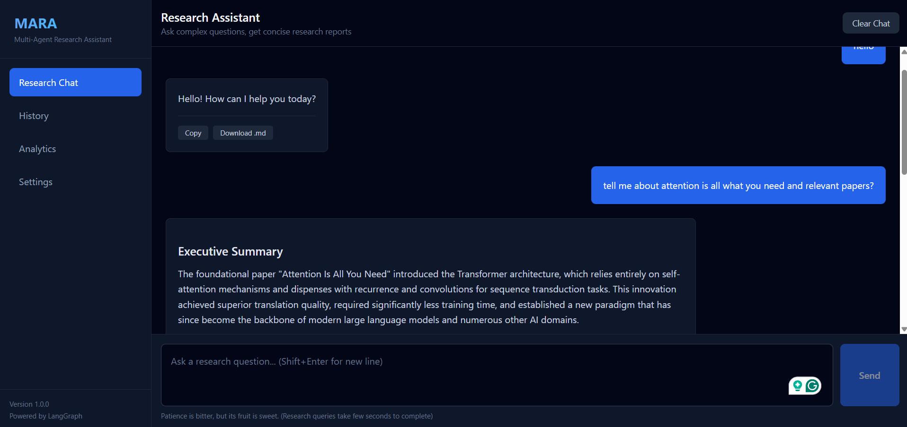
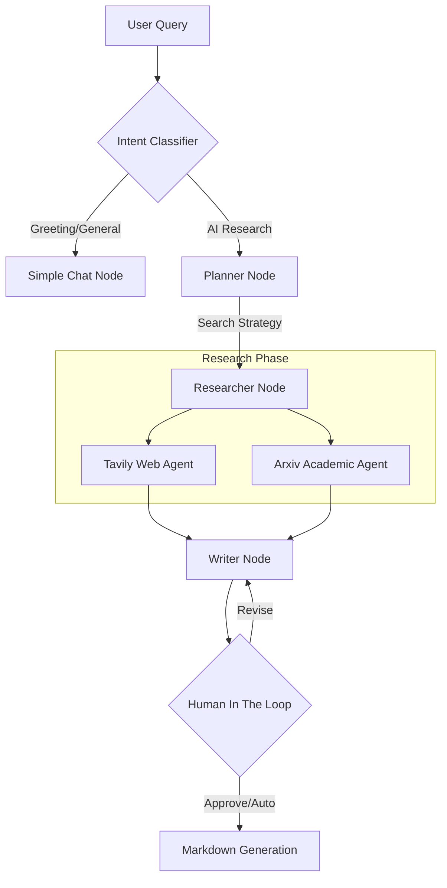

# MARA - Multi-Agent Research Assistant

MARA is a high-performance, agentic research platform built on **LangGraph**, **FastAPI**, and **React**. It transforms complex AI queries into concise, cited research summaries by orchestrating specialized agents for planning, web retrieval, academic search, and synthesis.

## Core Highlights
- **Agentic Orchestration**: Uses a state-based graph to manage complex research lifecycles.
- **Academic Grounding**: Direct integration with Arxiv for peer-reviewed AI insights.
- **Parallel Synthesis**: Concurrent tool execution reduces research latency by up to 60%.
- **Human-in-the-Loop**: Optional review node for expert-verified report generation.

## Demonstration

*MARA generating a concise AI research report with parallel agent execution.*

## Key Features
- **Parallel Multi-Agent Execution**: Orchestrates multiple LLM-powered agents to plan and execute research in parallel.
- **Deep Academic Integration**: Leverages Arxiv API for grounded, scientific AI insights.
- **Concise Citations**: Enforces strict grounding with authentic, verifiable sources.
- **Human-in-the-Loop**: Optional review node allowing experts to refine reports before final publication.
- **Stateless Architecture**: Designed for modern cloud environments like Vercel and Render.


## Architecture Workflow
MARA uses a sophisticated StateGraph to manage the research lifecycle:



## Project Structure
```text
MARA/
├── backend/            # FastAPI + LangGraph Backend
│   ├── app/
│   │   ├── agents/     # LangGraph nodes & workflow
│   │   ├── api/        # FastAPI routes & endpoints
│   │   ├── core/       # Configuration & State
│   │   ├── tools/      # Search integrations (Tavily/Arxiv)
│   │   └── db/         # Persistence layer
│   └── main.py         # Backend entry point
├── frontend/           # React + Vite Frontend
│   ├── src/
│   │   ├── components/ # Atomic UI components
│   │   ├── hooks/      # Custom research hooks
│   │   ├── services/   # API abstraction
│   │   └── types/      # TypeScript definitions
│   └── vite.config.ts  # Vite configuration
├── main.py             # Root ASGI wrapper
└── img/                # Visual assets & demos
```

## Tech Stack
- **Backend**: Python 3.11+, FastAPI, LangGraph, LangChain, Pydantic.
- **Frontend**: React 18, Vite, Tailwind CSS, TypeScript.
- **Inference**: DeepSeek via OpenRouter.
- **Search**: Tavily AI, Arxiv API.

## Quick Start (Local)

### 1. Backend Setup
```powershell
cd backend
python -m venv .venv
.\.venv\Scripts\activate
pip install -e .
uvicorn main:app --reload
```
*Ensure you have your `.env` configured with `OPENAI_API_KEY` (OpenRouter) and `TAVILY_API_KEY`.*

### 2. Frontend Setup
```powershell
cd frontend
npm install
npm run dev
```

If backend is not at default URL, set `frontend/.env`:
```dotenv
VITE_API_URL=http://localhost:8000
```
## Documentation
- [Portfolio & Design Philosophy](portfolio.md): Problem, Solution, and Key Learnings.
- [Deployment Guide](deployment.md): Technical guidelines for Vercel/Render and Git Workflow.

## License
Distributed under the MIT License.
